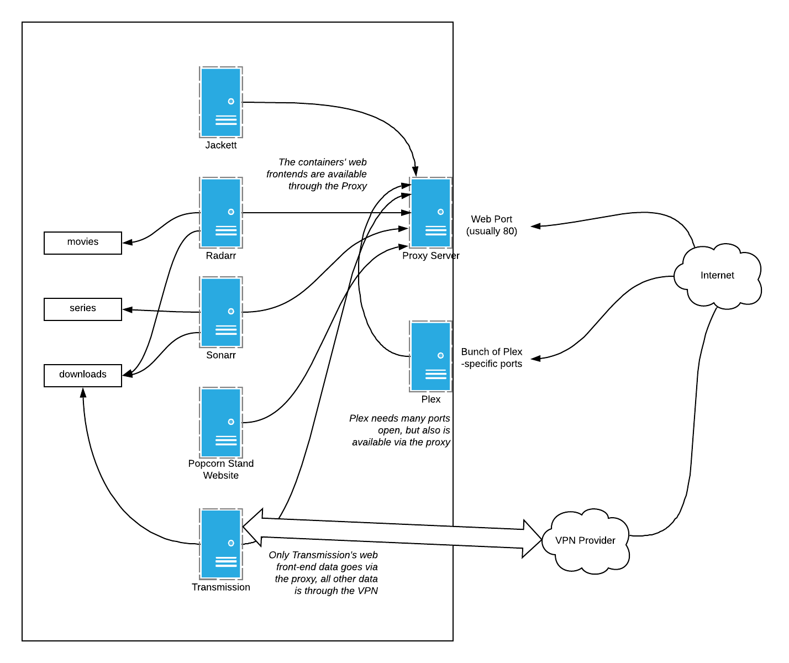

# The Popcorn Stand 🍿

Docker-based portable home server setup.

## How to set-up

1. Do a `cp env.example .env` and edit the `.env` file with your details.
2. Run `python3 setup.py`. This generates the html page that serves as the front-end. Run this everytime you edit `.env`.
3. Now do a `docker-compose up`. This will get everything up and running. For daemon mode, use the `-d` option.
4. Do the manual setup.

After this, there are a few things to setup:

* I find a hassle-free way to set up your local home network's DNS is just not to bother with self-hosted DNS servers. I just have a real domain (really niche domains like `.xyz` are really cheap) and then configure a wildcard subdomain to point to the home server this will be hosted on. So, the A record for `*.some.weird.domain.xyz` will point to the home server's internal IP. This is set up using the `URL` env.
* Set up your **Plex** server, you might have an issue creating a new server if you connect directly to `plex.some.weird.domain.xyz` so see https://github.com/linuxserver/docker-plex/issues/110 - the gist is that you need to be connecting from the same subnet to set up a Plex server. [You can try the ssh tunnel method that's described on the Plex website](https://support.plex.tv/articles/200288586-installation/). After that, map the `SERIES_DIR` and `MOVIES_DIR` directories to appropriate Plex libraries.
* Set up **Transmission** to point to the `DOWNLOADS_DIR` directory. Ideally don't use the incomplete directory setting.
* Set up **Jackett** and add a few trackers/websites.
* Set up **Radarr** and **Sonarr**:
  * Point to the relevant directories: `SERIES_DIR` for TV series, `MOVIES_DIR` for movies, and `DOWNLOADS_DIR` for eh
  * Point the download client to transmission (accessible via `transmission`, since Docker containers can talk to each other using their container names)
  * Point to Jackett (the API endpoints are accessible from `http://jackett:9117/***`)
* Set up **Calibre**. You need to have a pre-made Calibre library to do this. You need to have your library somewhere and map it to the `BOOKS_DIR` directory.
  * Set up your email stuff. Since Kindles allow you to get your books by emailing stuff to a `xxx@kindle.com` email, you can set up the SMTP settings to allow you send stuff to your Kindle from the web interface. [You can use Gmail's SMTP thing](https://www.google.com/search?q=gmail+smtp), and don't remember to [set up Insecure mode](https://support.google.com/accounts/answer/6010255?hl=en).

Now, assuming your `URL` is set to, say, `some.weird.domain.xyz`, everything will be accessible from `http://web.some.weird.domain.xyz`.

## What's inside

It's just a `docker-compose` file that includes all the basics you need for a media server at home:
* An organiser program for your media - Radarr organises your movies and Sonarr does it for your TV series
* A way to watch it - Plex is the way to go here. It's like having a self-hosted instance of Netflix
* Some degree of automation - Transmission is a media torrent downloader, and this can be connected to Radarr and Sonarr to download media automatically. Jackett allows you to download media from basically any tracker, public or private, so you need to point Radarr and Sonarr to it.
* We need books as well - Calibre is an ebook manager, and this web front-end for it can help you organise ebooks, as well as send it to your Kindle directly.
* Some degree of privacy - Transmission is set up to always use a proxy to download files
* A front-end interface - There's a bundled web server that just outputs a single html file with all links to the servers. Easily customisable.

A pseudo network diagram:



# Can you explain the .env file options

This is an example:

```
URL=some.weird.domain.xyz
OPENVPN_PROVIDER=NORDVPN
OPENVPN_CONFIG=some.nord.vpn.location.thing.com
OPENVPN_USERNAME=username
OPENVPN_PASSWORD=password
TIMEZONE=Asia/Choibalsan
SERIES_DIR=/home/popcorn/data/series
MOVIES_DIR=/home/popcorn/data/movies
DOWNLOADS_DIR=/home/popcorn/downloads
BOOKS_DIR=/home/popcorn/calibre
CONFIG_DIR=./config
HTTP_PORT=80
```

# Common problems and how to fix them

* Plex can't be set up - read the thing above.
* My VPN login doesn't work - It needs to use the OpenVPN standard username/password combos etc. Try getting a .ovpn file and match the settings variables.

# Improvement Ideas

* Have the configs done automatically.

# Disclaimer

This is merely a mash-up of a bunch of freely-available software, all available on GitHub.
